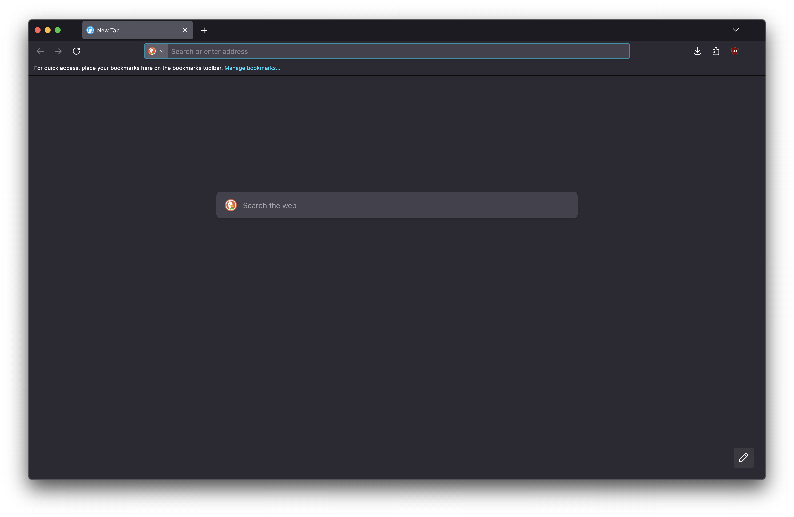
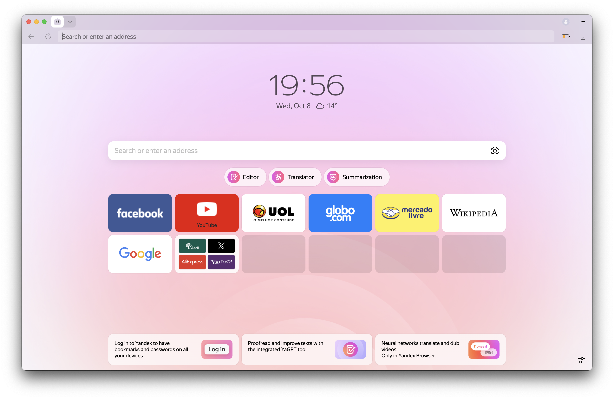

# Browsers
Just a list of browsers

[Aloha](https://github.com/SCLorentz/Browsers?tab=readme-ov-file#aloha)

[Arc](https://github.com/SCLorentz/Browsers?tab=readme-ov-file#arc)

[Basilisk](https://github.com/SCLorentz/Browsers?tab=readme-ov-file#basilisk)

[Brave](https://github.com/SCLorentz/Browsers?tab=readme-ov-file#brave)

[Chrome](https://github.com/SCLorentz/Browsers?tab=readme-ov-file#chrome)

[Dia](https://github.com/SCLorentz/Browsers?tab=readme-ov-file#dia)

[Duckduckgo](https://github.com/SCLorentz/Browsers?tab=readme-ov-file#duckduckgo)

[Edge](https://github.com/SCLorentz/Browsers?tab=readme-ov-file#edge)

[Falkon](https://github.com/SCLorentz/Browsers?tab=readme-ov-file#falkon)

[Firefox](https://github.com/SCLorentz/Browsers?tab=readme-ov-file#firefox)

[Floorp](https://github.com/SCLorentz/Browsers?tab=readme-ov-file#helium)

[Ladybird](https://github.com/SCLorentz/Browsers?tab=readme-ov-file#ladybird)

[Librewolf](https://github.com/SCLorentz/Browsers?tab=readme-ov-file#librewolf)

[Opera](https://github.com/SCLorentz/Browsers?tab=readme-ov-file#opera)

[Opera Air](https://github.com/SCLorentz/Browsers?tab=readme-ov-file#opera%20air)

[Opera Gx](https://github.com/SCLorentz/Browsers?tab=readme-ov-file#opera%20gx)

[Orion](https://github.com/SCLorentz/Browsers?tab=readme-ov-file#orion)

[Phoebe](https://github.com/SCLorentz/Browsers?tab=readme-ov-file#phoebe)

[Polypane](https://github.com/SCLorentz/Browsers?tab=readme-ov-file#polypane)

[Safari](https://github.com/SCLorentz/Browsers?tab=readme-ov-file#safari)

[SigmaOS](https://github.com/SCLorentz/Browsers?tab=readme-ov-file#sigmaOS)

[Surf](https://github.com/SCLorentz/Browsers?tab=readme-ov-file#surf)

[Tor](https://github.com/SCLorentz/Browsers?tab=readme-ov-file#tor)

[Ulaa](https://github.com/SCLorentz/Browsers?tab=readme-ov-file#ulaa)

[Ungoogled Chromium](https://github.com/SCLorentz/Browsers?tab=readme-ov-file#ungoogled%20chromium)

[Vivaldi](https://github.com/SCLorentz/Browsers?tab=readme-ov-file#vivaldi)

[Yandex](https://github.com/SCLorentz/Browsers?tab=readme-ov-file#yandex)

[Zen](https://github.com/SCLorentz/Browsers?tab=readme-ov-file#zen)

## Aloha

### General Info:

- Based on chromium

## Arc

### General Info:

- Closed source
- Only security updates nowadays
- Based on chromium

## Basilisk

## Brave

### General Info:

- Tor protocol support
- Unstoppable domains support
- Custom local AI models support
- Based on chromium
- Open source

## Goole Chrome

### General Info:

- Closed source
- Based on Chromium

### Chromium:

- Open source
- Blink engine

## Dia

### General Info:

- Closed source
- Based on Chromium

## Duckduckgo

### General Info:

- Based on chromium

## Edge

### General Info:

- Closed source
- Based on chromium

## Falkon

! having problems with compilation on macos

### General Info:

- Qt engine

## Firefox

### General Info:

- Open source
- Geckgo engine

## Floorp

## Helium

### General Info:

- Open source
- Based on chromium

### Patches:

- Ungoogled Chromium
- Bromite
- Brave
- Inox
- debian
- iridium-browser

## Ladybird

### General Info:

- Needs to be compiled manually
- Not for daily usage
- Open source
- Libweb engine

## Librewolf

### General Info:

- Based on firefox
- Open source

### Patches:

- Improved security

## Opera

### General Info:

- Based on chromium

## Opera Air

### General Info:

- Based on chromium

## Opera GX

### Self description:

A browser for gamers

### General Info:

- Based on chromium

## Orion

### General Info:

- Webkit engine
- Works for linux

## Phoebe

## Polypane

### General Info:

- Paid to use
- Closed source
- Not for daily usage
- Based on chromium

## Safari

### General Info:

- Only avaliable for apple sowftware
- Closed source
- Webkit engine

## Servo

### General Info:

- Open Source
- Not viable for daily usage
- Servo engine

## SigmaOS

### General Info:

- Avaliable only for MacOS
- Closed source
- Has a paid subscription
- Webkit engine

## Surf

## Tor

### General Info:

- Tor protocol support (obviously)
- Open source
- Based on firefox

### Patches:

- Tor protocol
- Improved security

## Ulaa

## Ungoogled Chromium

### General Info:

- Based on chromium

### Patches:

- Removal of google services
- Removal of proprietary blobs

## Vivaldi

## General Info:

- Baded on chromium

## Yandex

### General Info:

- Closed source
- Based on chromium

## Zen

### Patches:

- betterfox.js
